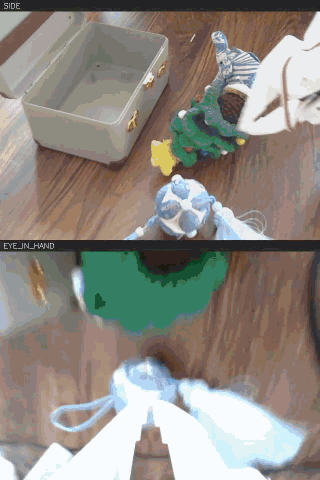
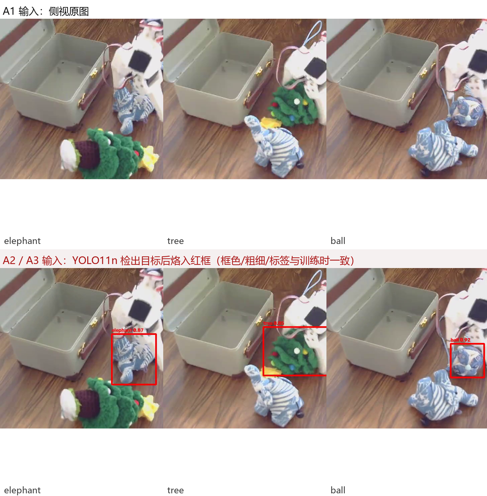
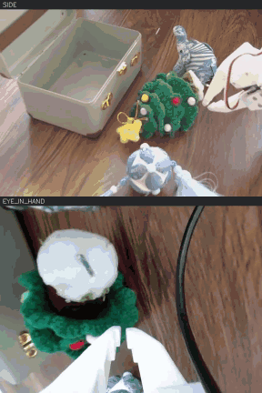
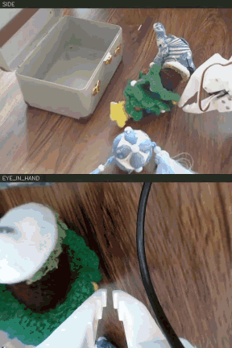
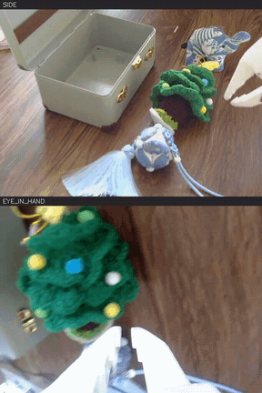
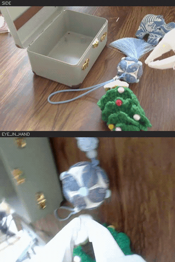
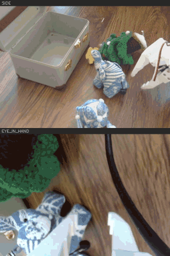

# pickplace-so101

> 基于 SO-ARM101 机械臂的桌面玩具抓取放置 —— 从数据采集、VLA 模型微调、云端推理服务到真机闭环测试的完整链路。

在一个 6 自由度 SO-ARM101 follower 上，用双相机（侧视 + 手眼）采集桌面 3 类玩具的抓取放置示教数据，
分别微调 **π0.5 (pi0.5)**、**SmolVLA-450M**、**Octo** 三个 VLA 模型，
部署为云端推理服务（RTX 4090）由本地机械臂闭环调用，并针对真机测试中暴露的问题做定位与优化。

---

## 目录

- [硬件与任务](#硬件与任务)
- [数据集](#数据集)
- [系统架构](#系统架构)
- [复现步骤](#复现步骤)
- [SmolVLA 微调和消融](#smolvla-微调和消融)
- [π0.5 LoRA 微调](#π05-lora-微调)
- [Octo 微调与消融](#octo-微调与消融)
- [真机测试结果](#真机测试结果)
- [未来改进：微调 OpenVLA](#未来改进微调-openvla)

---

## 硬件与任务

| 项 | 配置 |
|---|---|
| 机械臂 | SO-ARM101 follower，6 自由度（shoulder_pan / shoulder_lift / elbow_flex / wrist_flex / wrist_roll / gripper） |
| 相机 1 | 侧视 USB 相机（Logitech Brio 90），640×480 @ 30 fps，MJPG |
| 相机 2 | 手眼相机（装在腕部），640×480 @ 30 fps，MJPG |
| 上位机 | Windows，机械臂串口 `COM3` |
| 训练 / 推理 | 云端 AutoDL RTX 4090，SSH 隧道回传 |

**任务**：如下视频所示，桌面上同时摆放三个玩具（大象 / 树 / 球）和收纳盒，机械臂按照指令抓起目标玩具并放入收纳盒。



*一个完整的抓取放置周期。画面为双相机拼接：上半 **SIDE**（侧视）、下半 **EYE_IN_HAND**（手眼）。*

---

## 数据集

**自采数据集[reyqiao/lerobot_reyqiao_toy](https://huggingface.co/datasets/reyqiao/lerobot_reyqiao_toy)** — HuggingFace Datasets

| 指标 | 数值 |
|---|---|
| Episode 数 | 135（大象 / 树 / 球 各 45） |
| 总帧数 | 35,556 |
| 总时长 | ≈ 19.8 min @ 30 fps |
| 相机 | 2 路（`observation.images.side` + `observation.images.eye_in_hand`），640×480 |
| 状态 / 动作 | 6 维关节绝对位置（float32） |
| 机器人类型 | `so_follower` |
| 格式 | LeRobot **v3.0** |
| 体积 | ≈ 413 MB |

```python
from lerobot.datasets.aggregate import aggregate_datasets

aggregate_datasets(
    repo_ids=["local/lerobot_rey_toy_ball", "local/lerobot_rey_toy_elephant", "local/lerobot_rey_toy_tree"],
    aggr_repo_id="reyqiao/lerobot_reyqiao_toy",
    roots=[ROOT / s for s in SRC],
    aggr_root=OUT,
)
```

---

## 系统架构

```
┌─────────────────────────── 本地 (Windows) ───────────────────────────┐
│                                                                      │
│  双相机 ──┬─→ dual_camera_viewer.py   目视确认相机索引（每次开机必做）│
│           │                                                          │
│           ├─→ record_so101.py         遥操作采集 → LeRobot 数据集     │
│           │                                                          │
│           └─→ drive_so101_dual.py     ★ 真机闭环驱动                  │
│                    │  ① 读 6 维关节状态 + 双相机帧                     │
│                    │  ② POST /infer ──────────────────┐              │
│                    │  ③ 收到动作块，执行前 N 步         │              │
│                    │  ④ 显示「真正进入模型的那张 side 图」│              │
│                    └───────────────────────────────────┼──────────────│
└────────────────────────────────────────────────────────┼─────────────┘
                       SSH 隧道  -L 6010~6030 (6 条)      │
┌──────────────────────── 云端 (AutoDL RTX 4090) ─────────┼─────────────┐
│                                                          ▼            │
│   drive_so101_dual.py ──→ serve_smolvla_dual.py  :6010 A1 / :6011 A2  │
│                                                  :6012 A3 / :6020 Octo │
│                                                  :6021 Octo-infoNCE    │
│                                                  :6030 π0.5            │
│                                        │                              │
│                                        ├─(A2/A3)→ yolo_serve.py :6090 │
│                                        │          YOLO11n 检测目标     │
│                                        │          并把红框烙进 side 帧  │
│                                        ▼                              │
│                     SmolVLA-450M / Octo / π0.5 (微调权重)              │
└───────────────────────────────────────────────────────────────────────┘
```

> 端口：`6010` A1 / `6011` A2 / `6012` A3 / `6020` OCTO · OCTO_RB / `6021` OCTO_INF / `6030` π0.5。

---

## 复现步骤

### 0. 采集

```bash
python deploy/record_so101.py                # 遥操作采集 → LeRobot 数据集
```

### 1. 训练

#### SmolVLA

```bash
# 在服务器上
bash train/smolvla/train_A1.sh               # 基线，侧视原图
bash train/smolvla/train_A2.sh               # 侧视注入 YOLO 红框
bash train/smolvla/train_A3.sh               # 红框 + 框感知指令

# 后台跑
nohup bash train/smolvla/train_A1.sh > train_A1.log 2>&1 &
```

三个脚本**超参完全一致**，只有数据集与输出目录不同：

```bash
python smolvla_train_launcher.py \
  --dataset.root=$WORK/lerobot_rey_toy_all \
  --steps=10000 --batch_size=12 --num_workers=4 \
  --eval_steps=1000 --save_freq=1000 \
  --dataset.eval_split=0.11 \
  --output_dir=$WORK/outputs/train_A1 --job_name=toy_all_A1
```

#### π0.5

```bash
# 在服务器上（单卡 bs=8，effective batch = 8）
bash train/pi05/run_pi05_lora_r16_mlp.sh

# 实例有两块卡时可改回双卡 DDP（每卡 bs=4），effective batch 仍为 8
```

#### Octo

```bash
bash train/octo/run_finetune.sh
```

### 2. 部署

```bash
# 服务器：起 YOLO + A1/A2/A3 四个服务
bash deploy/serve_dual.sh start
bash deploy/serve_dual.sh status

# 本地：建立 SSH 隧道（Windows 上用 netstat -ano 判活，pgrep 匹配不到 ssh.exe）
bash deploy/tunnel_dual.sh start
```

### 3. 真机测试

```bash
# 先干跑（不动机器人），只打印动作与耗时
python deploy/drive_so101_dual.py --model A1 --toy tree --read-only

# 确认无误后真机执行
python deploy/drive_so101_dual.py --model A1 --toy tree --move --max-cycles 20 --display
```

| 参数 | 含义 |
|---|---|
| `--model` | `A1` / `A2` / `A3` / `OCTO` / `OCTO_RB` / `OCTO_INF` / `PI05`，对应上表端口 |
| `--toy` | `elephant` / `tree` / `ball`，决定下发的语言指令 |
| `--read-only` / `--move` | 只推理不动机器人 / 真机执行 |
| `--max-cycles` / `--exec-steps` | 闭环轮数 / 每轮执行动作块的前 N 步 |
| `--abs-clamp` | 默认开：关节目标绝对值限幅，防单步大跳 |
| `--diverge-stop` | 检测到动作发散立即停机 |
| `--success-detect` | 依据夹爪开合与抬升高度自动判成功 |

> ⚠️ 真机运动必须有人在场、急停就绪。`--read-only` 先跑通再 `--move`。

---

## SmolVLA 微调和消融

SmolVLA-450M用同一批数据微调。

VLM 整个冻结，直接训练下游的动作专家，由它自己决定怎么用 VLM 已有的视觉表征。

### 训练配置

`train/smolvla/train_A1.sh`（A2 / A3 逐字同参，只换数据集与输出目录）：

| 项 | 值 |
|---|---|
| 基座 | `lerobot/smolvla_base`，共 **450 M** |
| 微调方式 | **动作专家全量训练**（无 LoRA）；可训练 **99.9 M / 450.0 M ≈ 22%** |
| 冻结部分 | **整个 VLM**, 视觉编码器与语言塔都不动 |
| 输入分辨率 | **512×512**（`resize_imgs_with_padding`） |
| 图像输入 | `side` + `eye_in_hand` 两路（SmolVLA 视觉塔固定 3 槽，空槽用 dummy 填充） |
| 语言 | 按最大长度 padding，tokenizer 上限 48 |
| 动作块 | `chunk_size = 50`，`n_action_steps = 50`；流匹配推理步数 10 |
| batch / lr / steps | **12** / 1e-4（warmup 1000 → decay 30000 到 2.5e-6）/ **10000** |

### 消融设计：A1 / A2 / A3

三个变体的**训练超参完全相同**，只改输入表征：

| 变体 | 数据集 | 侧视图输入 | 语言指令 |
|---|---|---|---|
| **A1** | `lerobot_rey_toy_all` | 原图 | `Pick up the {toy} and place it into the box` |
| **A2** | `..._redbox` | **YOLO11n 检出目标后烙入红框** | 同上（不变） |
| **A3** | `..._redbox_a3` | 同 A2 | `Pick up the {toy} **in red box** and place it into the box` |

动机：测试发现模型容易把注意力放到机械臂自身运动上，而越过语言指令指定的抓取目标。
用 YOLO 把目标直接标注在输入上，等于**把「看哪里」这件事直接告诉模型**，
让策略网络专注学「怎么动」。A3 进一步用语言显式指代红框，测试语言是否能与视觉线索绑定。



*同一帧画面：左为 A1 看到的侧视原图，右为 A2/A3 看到的、烙入 YOLO11n 目标框后的图。*

### 训练结果

三个变体在 step 5000（验证 loss 最低点）的验证 loss：

| 变体 | 验证 loss @ 5000 |
|---|---|
| A1 | 0.2832 |
| A2 | 0.2907 |
| A3 | 0.2923 |

**三者统计上无显著差异，A1 反而最低。** 这说明验证 loss 这个指标**无法区分**
「模型是否真的在看目标」—— 它与真机成功率不是一回事，消融结论必须由真机 rollout 给出。

---

## π0.5 LoRA 微调

π0.5（SigLIP 0.4 B + VLM 2.6 B + 动作专家 0.3 B ≈ **3.3 B**）用同一批数据微调。
冻结视觉塔，LoRA 挂在注意力**和动作专家的 MLP**上。

`train/pi05/run_pi05_lora_r16_mlp.sh`：

| 项 | 值 |
|---|---|
| 微调方式 | LoRA rank **16** / alpha 32 / dropout 0.05 |
| 可训练参数 | **7.55 M / 3.3 B ≈ 0.23 %**（适配器 256 个张量，全部 F32） |
| LoRA 挂载 | **128 个模块**，四组： |
| ├ 动作专家 MLP | `gemma_expert` 的 `gate_proj` / `up_proj` / `down_proj` **54** 个 → **4.42 M（58.6 %）** |
| ├ VLM 注意力 | `paligemma.language_model` 的 q/v **36** 个 → 1.84 M（24.4 %） |
| ├ 动作专家注意力 | `gemma_expert` 的 q/v **36** 个 → 1.25 M（16.6 %） |
| └ 动作投影 | `action_in_proj` / `action_out_proj` 2 个 → 0.03 M（0.4 %） |
| 冻结部分 | 视觉编码器（`freeze_vision_encoder=true`） |
| 输入分辨率 | **224×224** |
| 图像输入 | `side` + `eye_in_hand` 两路 |
| 动作块 | `chunk_size = 50`，扩散/流匹配推理步数 10 |
| batch / lr / steps | effective **8** / 1.5e-5 / 20000 |

---

## Octo 微调与消融

Octo 用同一批数据微调。

### 数据格式转换

Octo 用的是自己的一套数据管线，需要先把 LeRobot 数据集转成逐 episode 的 npz：

```bash
# LeRobot v3.0  →  octo_frames/<toy>/ep_<N>.npz
python data/lerobot_to_octo_frames.py \
    --root /path/to/lerobot_rey_toy_elephant --toy elephant \
    --out  /path/to/octo_frames --size 256

# 自查：逐条比对 npz 的 T 与 meta 里的 episode length
python data/lerobot_to_octo_frames.py --root ... --toy ... --out ... --verify-only
```

每个 npz 含 `side` / `wrist` / `action` / `state` / `lang`。
转换器**刻意不依赖 `torchcodec`** —— 直接 `pyarrow` 读 parquet + `PyAV` 解码 mp4，
只需 `pyarrow` 和 `av` 两个纯 pip 依赖，在 Windows 和服务器上都能跑。

再由 `data/lerobot_toy_dataset.py`（TFDS builder `LerobotToy`）与 `data/build_tfds.py` 打包成 TFDS。

### 训练配置

`train/octo/finetune_octo_lora_qv.py`：

| 项 | 值 |
|---|---|
| 解冻部分 | ① **transformer MLP 全量 56.67 M**<br>② DiffusionActionHead 全量 1.80 M<br>③ 语言投影 0.60 M<br>⇒ **可训练合计 59.4 M / 202.8 M ≈ 29 %**（对 93 M 骨干 ≈ **64 %**） |
| 冻结部分 | ViT、T5 语言塔（**109.6 M**）、attention base kernel（28.3 M）、LayerNorm |
| window / horizon | 2 / 4 |
| 图像尺寸 | primary 256×256，wrist 128×128 |
| batch / lr / steps | 8 / 1e-4 / 16000 |

### 消融设计：Base vs infoNCE

Octo 微调完在真机上会**忽略语言指令，只按画面的视觉显著性挑目标**（现象见下文「真机测试结果」的 Octo 小节）。
为了逼它把语言用起来，在 LoRA 基线上加了一路 **infoNCE 辅助对比损失**。

对比损失作用在 `readout_emb` —— DiffusionHead 的输入条件向量，也就是「图像 + 语言」融合之后那个固定长度的向量：

| | 构造 |
|---|---|
| **正样本** | 同一帧图像 + **正确的**语言指令 |
| **负样本** | 同一帧图像 + **错误的**语言指令（换成去抓另一个 toy） |

损失直接惩罚「**语言指令换了、但 `readout_emb` 却没怎么变**」的情形，即逼 readout 对语言敏感。

训练侧只加这一项：`train/octo/run_infonce.sh` 与 `run_finetune.sh` 的差异**只有** `--infonce_w` / `--infonce_margin` 两个参数。

### 度量：语言在这一层有多少话语权

在**输出端**量语言的相对话语权，三个量由 `train/octo/probes/diag_lang_layers.py` 给出：

| 量 | 含义 |
|---|---|
| **ΔL**（语言驱动） | 同一帧，指令从 REF 换成别的，输出变化了多少 |
| **ΔV**（视觉驱动） | 同一条指令，画面帧变化了，输出变化多少 |
| **S = ΔL / ΔV** | 相对画面，语言在**这一层**有多少话语权 |

- `readout S` —— 把 `readout_emb` 当输出测
- `action S` —— 把 action 当输出测

对 **6 帧 × 4 个非 REF 指令**（ball / elephant / empty / gibberish）全跑一遍取平均。
其中 REF = `tree`，6 帧 = 3 个玩具 × 2 帧；`empty`（空指令）与 `gibberish`（无意义词）是控制项，用来排除「只要指令变了就行」这种解释。

**比值 `S_readout / S_action` 是语言话语权的「穿透率」：**

- **≈ 1** → 语言在两层的话语权一样大，动作头既没放大也没吞掉 —— baseline 是 **0.93**
- **> 1** → readout 里语言话语权更大，说明**动作头把它压下去了** —— 压掉的部分就是没穿透的

### 结果

| checkpoint | readout ΔL | readout S | 动作 ΔL | 动作 S | **S_readout / S_action** |
|---|---|---|---|---|---|
| baseline /12000 | 0.0158 | 0.13 | 0.0499 | 0.14 | **0.93** |
| infoNCE_well /2000 | 1.1645 | 10.08 | 0.7934 | 1.46 | **6.90** |
| infoNCE_well /8000 | 1.1618 | 9.01 | 0.2659 | 0.80 | **11.2** |

辅助损失**确实把语言写进了 readout**：`readout S` 从基线的 0.13 涨到 10.08（约 78 倍），
`readout ΔL` 也从 0.0158 涨到 1.16。**但穿透率反而恶化了**：

- infoNCE /2000 是 **6.9** —— readout 上语言话语权比动作上大 6.9 倍，
  也就是**约 6/7 的相对语言结构没能穿过动作头**
- 到 /8000 涨到 **11.2**，穿透率进一步恶化

### 可能根源

> Octo 将图像、语言特征 **→ 融合压缩成 一个固定长度向量 `readout_emb`**，容量有限；
> 图像空间信息（物体位置、靠近哪边玩具）的信号强度往往**远大于**语言语义信号
> → 动作头（语言很容易丢）。

**这一路改动没有产出比 baseline 更好的 checkpoint**，它作为一次**被证伪的假设**留在这里：
语言条件失效不是「readout 没编码语言」，而是「编码了也压不过图像」。

---

## 真机测试结果

### 测试所用 checkpoint

epoch 按 `step × effective_batch ÷ 训练帧数` 折算，训练帧数 ≈ 31,605（135 条中 11% 划作验证）。

| 模型 | 真机所用 checkpoint | epoch |
|---|---|---|
| SmolVLA A1 / A2 / A3 | step 5000 | ≈ 2 |
| Octo | step 12000 | ≈ 3 |
| π0.5 | step **020000** | ≈ 5 |

### SmolVLA A1 / A2 / A3 成功率

每个模型各跑 **15 次真机测试**（大象 / 树 / 球 每类 5 次），单次 `--max-cycles 20 --exec-steps 15`。
下表是这 15 次的逐次明细。其中M,L,R代表玩具分别摆放在中间，左边，右边。

| 目标玩具 | 第 N 次 | A1 | A2 | A3 |
|:--|:-:|:-:|:-:|:-:|
| Tree(M) | 1 | ❌ | ✅ | ✅ |
| Tree(M) | 2 | ✅ | ❌ | ✅ |
| Tree(M) | 3 | ✅ | ✅ | ✅ |
| Tree(L) | 4 | ✅ | ✅ | ✅ |
| Tree(R) | 5 | ✅ | ✅ | ✅ |
| **Tree 小计** | **5** | **4 / 5** | **4 / 5** | **5 / 5** |
| Ball(M) | 1 | ❌ | ✅ | ✅ |
| Ball(M) | 2 | ❌ | ❌ | ❌ |
| Ball(M) | 3 | ❌ | ✅ | ✅ |
| Ball(L) | 4 | ❌ | ✅ | ✅ |
| Ball(R) | 5 | ❌ | ❌ | ❌ |
| **Ball 小计** | **5** | **0 / 5** | **3 / 5** | **3 / 5** |
| Elephant(M) | 1 | ❌ | ✅ | ✅ |
| Elephant(M) | 2 | ✅ | ✅ | ✅ |
| Elephant(M) | 3 | ❌ | ❌ | ✅ |
| Elephant(L) | 4 | ❌ | ✅ | ✅ |
| Elephant(R) | 5 | ❌ | ✅ | ❌ |
| **Elephant 小计** | **5** | **1 / 5** | **4 / 5** | **4 / 5** |

**15 次测试的合计成功率（不分玩具）：**

| 模型 | 成功次数 | 测试次数 | 成功率 |
|:--|:-:|:-:|:-:|
| **A1** | **5** | 15 | **33.3 %** |
| **A2** | **11** | 15 | **73.3 %** |
| **A3** | **12** | 15 | **80.0 %** |

> A1 → A2 提升 **+40.0** 个百分点，来自把「目标在哪」直接告诉模型；
> A2 → A3 只再涨 **+6.7** 个百分点，说明额外的语言指代（"in red box"）带来轻微收益 ——
> 但主要增益来自视觉注意力的显式注入。
> 分玩具看：A1 在 ball 上 **0 / 5**（目标最小、最不好抓取），A2/A3 把它拉到 3 / 5 以上。

### 演示视频

以下均为真机实拍，画面为双相机拼接：上半 **SIDE**（侧视）、下半 **EYE_IN_HAND**（手眼）。

#### 1) A1 的动作捷径问题

指令是 `Pick up the ball and place it into the box`（抓左侧的球），
A1 却抓成了正前方的 tree。**A1 过拟合了示教轨迹**，
无法有效响应 `pick up [具体物体]` 的文本指令，导致抓错物体或空抓。



#### 2) A2：用 YOLO11n 给 SmolVLA 注入「视觉注意力」

同一条指令、同一套初始摆放，A2 先用 YOLO11n 检出目标、把红框烙进侧视图再送入策略网络，
成功抓到了左侧的 ball。



#### 3) π0.5：抓取动作明显更平滑流畅

指令 `Pick up the tree and place it into the box`，π0.5 直接走向绿树、夹起、抬升、放箱，一次到位。



相比于 SmolVLA 与 Octo，π0.5 的**抓取动作明显更平滑流畅**：轨迹连续、几乎看不到中途停顿或来回修正，
夹爪开合时机也更干净。

#### 4) π0.5：同样存在忽略语言的问题

但 π0.5 和 Octo 犯的是**同一个病**。下图中指令要求抓**左侧的 tree**，
机械臂却转头去够**中间的 ball**，最后**空抓**（箱子边上什么也没夹到，绿树原封不动留在桌上）。



可能原因分析：

- **噪声地板**：同一帧、同一句指令，连跑 **4 次**，各关节预测角度的平均差 —— 这是模型自带的随机抖动。
- **语言差**：同一帧，把指令换成 `elephant` / `tree` / `ball` **各跑 4 次**，看这三条平均轨迹互相差多远（单位：度）。

| 关节 | j1 | j2 | j3 | j4 | j5 | grip |
|---|---|---|---|---|---|---|
| 噪声地板（同帧同指令重跑） | 6.96 | 22.09 | 21.86 | 9.36 | 6.84 | 19.90 |
| 语言差（同帧换指令） | 6.70 | 10.37 | 10.66 | 4.03 | 4.58 | 10.14 |


**结论：如上图可见语言变化的敏感度极低，模型忽略了语言指令中的目标物体。** 模型确实会朝**画面上那个目标**转，
但它靠的是**长相**，不是指令。

#### 5) Octo：忽略语言指令，按视觉显著性选目标

指令是抓 elephant，Octo 却去抓了左侧的 ball —— 虽然抓取与放置动作本身都成功完成了。
说明其语言条件已退化，策略实际上在按「哪个目标更显眼」选择物体。



### 推理耗时

云端推理服务器为 RTX 4090 24G。三个模型都跑「云端规划 → 本地执行」的闭环。

| 模型 | 参数量 | 微调方式 | 输入分辨率 | 云端前向 | 网络往返 | **单轮规划** | 每轮执行 | 约需轮数 | 整体 |
|---|---|---|---|---|---|---|---|---|---|
| **π0.5** | 3.3 B | LoRA r16<br>+ 动作专家 MLP | 224×224 | ≈ 420 ms | ≈ 100 ms | **≈ 520 ms** | 20 步 | 10 ~ 12 | ≈ 5~6 s |
| **SmolVLA-450M** | 450 M | 微调<br>（仅动作专家） | 512×512 | ≈ 300 ms<br>（A2/A3 另加 YOLO ≈ 40 ms） | ≈ 140 ms | **≈ 480 ms** | 15 步 | 13 ~ 15 | ≈ 6 ~ 7 s |
| **Octo Base** | 93 M | **LoRA r8（Q/V）0.29 M**<br>+ transformer MLP 56.7 M<br>+ ActionHead 1.8 M<br>+ 语言投影 0.6 M<br>⇒ **可训练 59.4 M**<br>（/202.8 M ≈ **29 %**） | 256×256（primary）<br>128×128（wrist） | ≈ 130 ms | ≈ 50 ms | **≈ 180 ms** | 4 步 | 55 ~ 60 | ≈ 10 ~ 11 s |

---

## 未来改进：微调 OpenVLA

本轮把瓶颈定位在「**指令里的名词 ↔ 图像里的目标区域**」这条绑定上。
下一版计划把基座换成 **OpenVLA**（7 B，LLaVA 风格的多模态基座）—— 它的多模态对齐与 grounding 能力更强，因为：

**① OpenVLA 的两个 ViT 特征天然互补：DINOv2（管在哪）+ SigLIP（管是什么）—— 空间几何定位 + 语义对齐。**

**② 预训练目标里天然就包含语言–视觉区域绑定** —— LLaVA 风格多模态预训练数据（描述 / 区域级问答 / 指代定位）+ Open X-Embodiment ≈ 97 万条真机 episode。

---

## License

Apache-2.0
